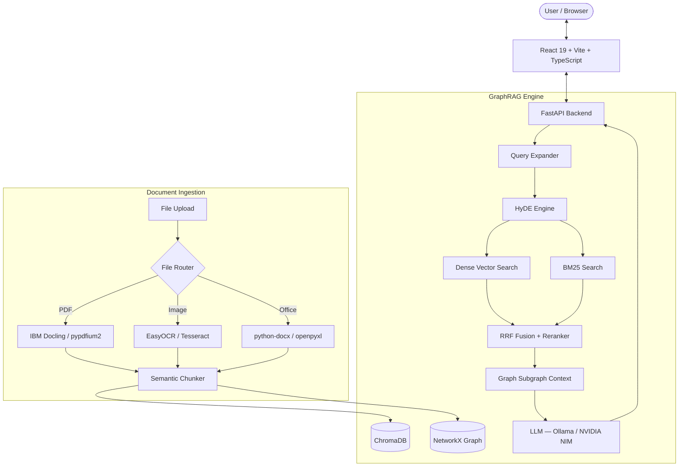

# 🎓 DeepTutor — AI GraphRAG Learning Platform

[](https://fastapi.tiangolo.com/)
[](https://react.dev/)
[](https://www.typescriptlang.org/)
[](https://www.trychroma.com/)
[](https://www.netlify.com/)
[](https://opensource.org/licenses/MIT)

> **DeepTutor** is a privacy-focused, open-source AI learning platform powered by a hybrid **GraphRAG architecture** — combining Dense Vector Search, Sparse BM25, and Knowledge Graph Subgraphs to answer questions strictly from your uploaded study documents.

---

## ✨ Key Features

| Feature | Description |
|:--------|:------------|
| 🧠 **Hybrid GraphRAG Chat** | Dense + BM25 hybrid search, Reciprocal Rank Fusion, Knowledge Graph context |
| 📑 **Multi-Format Document Ingestion** | PDF, PNG, JPG, WEBP, DOCX, CSV, XLSX, PPTX, HTML, TXT, MD |
| 🔍 **Advanced Retrieval** | HyDE, Query Expansion, Contextual Compression, Cross-encoder Reranking |
| 📊 **Knowledge Graph Visualizer** | Interactive d3-force entity/relationship graph |
| 🎮 **AI Quiz Engine** | Gamified multiple-choice quizzes generated from your documents |
| 🎴 **3D Flashcards** | Flippable cards with keyboard navigation and Text-to-Speech |
| 📅 **Study Plan Generator** | Day-by-day study roadmap with progress tracking |
| 🏆 **Leaderboard & Progress** | XP system, badges, accuracy tracking across all quiz attempts |
| 🧪 **RAG Evaluation Suite** | DeepEval + Ragas benchmarks — faithfulness, precision, latency |

---

## 🏗️ Architecture



---

## 🛠️ Tech Stack

| Layer | Technology |
|:------|:-----------|
| **Frontend** | React 19, TypeScript, Vite, Framer Motion, Zustand, TanStack Query |
| **Styling** | Vanilla CSS + Tailwind utility classes |
| **Backend** | FastAPI, Python 3.13, Uvicorn, Pydantic v2 |
| **Database** | SQLAlchemy + SQLite |
| **Vector Store** | ChromaDB |
| **Knowledge Graph** | NetworkX |
| **LLM / Embeddings** | Ollama (local) — or NVIDIA NIM API (cloud) |
| **Document Parsing** | IBM Docling, pypdfium2, pdfplumber, python-docx, openpyxl |
| **Evaluation** | DeepEval, Ragas |
| **Deployment** | Netlify (frontend) + Render (backend) |

---

## 🚀 Quick Start

### Prerequisites

- **Python 3.10+** (3.13 recommended)
- **Node.js 18+** & npm
- **Ollama** running locally with models pulled:
  ```bash
  ollama pull llama3.1
  ollama pull nomic-embed-text
  ```
- *(Optional)* NVIDIA GPU with CUDA for accelerated PDF parsing

---

### 1. Clone the Repository

```bash
git clone https://github.com/Harryy17/DeepTutor.git
cd DeepTutor
```

---

### 2. Backend Setup

```bash
cd backend

# Option A — Automatic (Windows, installs deps + starts server)
.\start.bat

# Option B — Manual
python -m venv .venv
.venv\Scripts\activate        # Windows
# source .venv/bin/activate   # macOS / Linux
pip install -r requirements.txt
uvicorn app.main:app --reload --port 8000
```

> API docs available at: **http://localhost:8000/docs**

#### Environment Variables

Copy `.env.example` to `.env` and edit:

```bash
cp backend/.env.example backend/.env
```

```env
# LLM — Local Ollama (default)
OLLAMA_BASE_URL=http://localhost:11434
OLLAMA_CHAT_MODEL=llama3.1
OLLAMA_EMBED_MODEL=nomic-embed-text

# Security
SECRET_KEY=your-secret-key-here
```

---

### 3. Frontend Setup

```bash
cd frontend
npm install
npm run dev
```

> Open **http://localhost:5173** in your browser.

---

## 🌐 Deployment

### Frontend — Netlify (Free)

The `netlify.toml` is pre-configured. Steps:

1. Push repo to GitHub
2. Connect to [Netlify.com](https://netlify.com) → **New Site from Git**
3. Set build settings:
   - **Base directory**: `frontend`
   - **Build command**: `npm run build`
   - **Publish directory**: `frontend/dist`
4. Add environment variable:
   - `VITE_API_BASE_URL` = `https://your-backend.onrender.com/api`
5. Click **Deploy Site**

### Backend — Render (Free)

1. Go to [Render.com](https://render.com) → **New Web Service**
2. Connect your GitHub repo
3. Set:
   - **Build command**: `pip install -r backend/requirements.txt`
   - **Start command**: `cd backend && uvicorn app.main:app --host 0.0.0.0 --port $PORT`
4. Add env vars: `SECRET_KEY`, `NVIDIA_API_KEY` (if using NVIDIA NIM)

> ⚠️ Render's free tier spins down after 15 min inactivity (~30s cold start).

### Using NVIDIA NIM API (No Local Ollama Required)

Sign up for a free API key at [build.nvidia.com](https://build.nvidia.com) and update your `.env`:

```env
NVIDIA_API_KEY=nvapi-xxxxxxxxxxxx
NVIDIA_CHAT_MODEL=meta/llama-3.1-8b-instruct
NVIDIA_EMBED_MODEL=nvidia/nv-embedqa-e5-v5
```

---

## 📁 Project Structure

```
DeepTutor/
├── backend/
│   ├── app/
│   │   ├── api/          # REST endpoints (chat, auth, quiz, flashcards, etc.)
│   │   ├── core/         # Config, database, models
│   │   └── rag/          # GraphRAG pipeline, vector store, graph store, LLM client
│   ├── requirements.txt
│   ├── start.bat         # Auto-install + start (Windows)
│   └── .env.example
├── frontend/
│   ├── src/
│   │   ├── components/   # Layout, ChatMessage, GraphContextPanel, etc.
│   │   ├── pages/        # ChatPage, DashboardPage, QuizPage, etc.
│   │   ├── services/     # API client
│   │   └── stores/       # Zustand state (auth, chat)
│   ├── netlify.toml
│   └── package.json
├── chroma_data/          # ChromaDB persisted vectors (gitignored in production)
├── graph_data/           # NetworkX knowledge graphs
├── uploads/              # User-uploaded documents
└── README.md
```

---

## 📊 RAG Evaluation

Run the built-in benchmark suite:

```bash
cd backend
python evaluate_rag.py
```

Results saved to:
- `backend/rag_evaluation_report.md`
- `backend/deepeval_ragas_evaluation.json`

**Benchmark metrics tracked:**
- Context Precision @K
- Context Hit Rate
- Mean Reciprocal Rank (MRR)
- Faithfulness Score
- Answer Relevancy
- P50 / P95 Retrieval Latency
- Generation TPS

---

## 🤝 Contributing

1. Fork the repository
2. Create a feature branch: `git checkout -b feature/my-feature`
3. Commit changes: `git commit -m "feat: add my feature"`
4. Push to branch: `git push origin feature/my-feature`
5. Open a Pull Request

---

## 📜 License

Distributed under the **MIT License**. See [LICENSE](LICENSE) for details.

---

Built with ❤️ by the DeepTutor Team. Star ⭐ this repo if you find it useful!#
# TutorMVP

